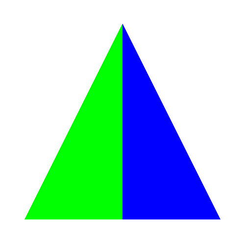
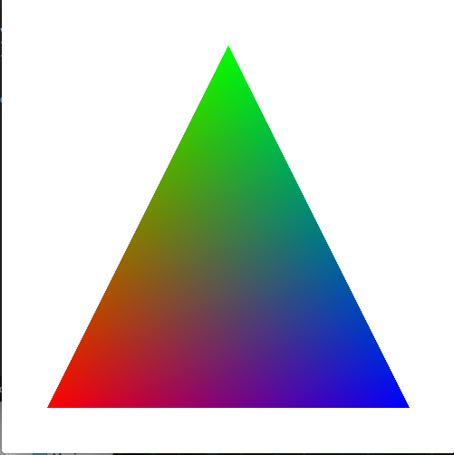
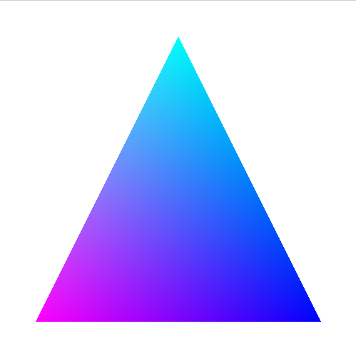

#Tutorial 1

##Introduction
In this tutorial I will walk you through on how to work with the GLSL language. We will first start out with a triangle and eventually work on a cube.

##Single/Multi Colored Triangle
Upon inital execution of the tutorial program the triangle should be already a single color. As was shown in the video it is fairly easy to change the color of the whole triangle. But what if we wanted half the triangle to be a different color, say red? Going back to our roles of the shaders a vertex shader handles only vertex coordinate information. Fragment Shaders on the other hand are primarily concerned about the color of fragments which if you remember are a sampling of pixels of a certain area. 

One built in attribute of fragment shaders is whats called ```gl_FragCoord```. It provides the fragment coordinates in screen coordinates. I have provided a uniform 2 dimensional vector called screen with contain the screen's width and height. To make half the triangle blue we can check the fragment's coordinate with it position on the screen. This can be done in the **Fragment Shader** like this:
```c++
#version 410

uniform vec2 screen;
out vec4 FragColor;

void main() {
  if(gl_FragCoord.x/screen.x < 0.5){
    FragColor = vec4(0.0,1.0,0.0,1.0);
  }else{
    FragColor = vec4(0.0,0.0,1.0,1.0);
  }
}
```
Our **Vertex Shader** should look like this as well:
```c++
#version 410

in vec3 VertexPosition;


void main() {
    gl_Position = vec4(VertexPosition.x, VertexPosition.y , VertexPosition.z , 1.0);    
}
```

The result should look like this assuming the other color was green:


###Explanation of code
The version number needs to be at the top of the file. This tells OpenGL what GLSL language to compile it as. In our case it is version 4.1. After this we include all of our variables.
 
Remember in GLSL there are two type of variables, attributes and uniforms. Our attributes are designated with the key word ```in``` or the keyword ```out```. Remember these variables are for data that changes frequently and are composed of a large dataset. The ```in``` keyword signifies what it implies, that the variable is being supplied the data externally. It also means that it cannot be changed. ```out``` signifies what is being returned from our shader program. There are some built in attributes as well which as designated with the prefix ```gl_```. 

Uniform variables if you remember are variables that change less frequent and are composed of a much smaller dataset. The only uniform we are using in this example is ```screen```. This gives us the width and height of the window as a two dimensional vector;

So in the VertexShader we are telling OpenGL to map our VertexPosition Coordinates to our Clipping Coordinates for the triangle. This is **NOT** usually how you would do it. The reason this works is that the triangle's vertex positions range from -0.8 to 0.8. This fits nicely into our clipping coordinates and so for this example it was adequate. Later only we will go over how to project these coordinates in a more appropriate manner. Another thing to note is that this shader is run for every vertex OpenGL will draw.

In the Fragment Shader we use a custom uniform called ```screen```. We use it to get what percentage of the screen the the fragment is located. We then compare it to a percentage, in this case ```0.5``` and set the fragment color to either blue or green.

##Built-In Colored Triangle
In the last example we hardcoded the color of the triangle within the shader. In our program though our vertices have a defined color but we are ignoring them. To use the color we need add this attribute to our vertex shader:
```c++
in vec3 VertexColor;
```
We will not be using this in the vertex shader but will be passing the attribute to our fragment shader. Any custom out attributes we define can used later in the pipeline such as in our fragment shader. So this means we also need to include an out attribut in our vertex shader:
```c++
out vec3 Color;
```
Then in our main we would assign VertexColor to Color:
```c++
void main() {
    Color = VertexColor;
    gl_Position = vec4(VertexPosition.x, VertexPosition.y , VertexPosition.z , 1.0);    
}
```
We can now use the Color attribute in our fragment shader. To do this we also need to add the Color attribute like this:
```c++
in vec3 Color;
```
And to use the Color in our main we would do something like this:
```c++
void main() {
  FragColor = vec4(Color,1.0);
}
```
You should notice that I did not just assign Color to FragColor but rather created a new vec4 using Color. This is because FragColor is a vec4 and Color is a vec3. we very easily could have defined Color as a vec4 and just simply assigned it but since the alpha value is constant we didn't need to. Compiling this should result in this:


###Why does this do this?
First off we need to realize that our VertexColor attribute only specified **3 colors**, not all the colors that we see. When our fragments are generated it samples the colors of the vertices around the fragment. This creates an effect that the colors are mixed or interpolated. This is why the colors become more defined as you approach the actual vertices as the fragment is closer and should have more of that color than the other vertice colors.

##Changing Color Triangle
In the previous example we used the built int colored vertices for displaying the triangle. What if we wanted to triangle to change colors after a certain amount of time? There is another uniform called ```timer```. It is a float that increments 0.01 every time the screen gets rerenders.

Another thing to keep in mind is that GLSL supports basic math operations such at matrix or trig operations. In our example the ```sin()``` function will work splendidly as if will let use oscilate between colors by imposing one of the colors onto the sin curve.

To do this we are going to use the equation ```0.5 + 0.5 * sin(timer)```. So how does this work? Remember that each color value must be in the range of 0 and 1. And the sin function will return a value fron -1 to 1. So by multiplying the sin value by 0.5 we can get a value from -0.5 and 0.5. Add this to 0.5 and we effectively get an oscillating range from 0 to 1.

So lets try this out. First off the vertex shader can stay the same as the last tutorial but the fragment shader needs to be changed to look like this:
```c++
#version 410

in vec3 Color;
uniform float timer;
uniform vec2 screen;
out vec4 FragColor;

void main() {
  FragColor = vec4(Color.x, Color.y, 0.5 + 0.5 * sin(timer), 1.0);
}
```
So what we ended up doing here is using the red and green colors from our triangle and then oscillating our blue value. We should get a triangle like this but with the colors gradually changing:



##Transformations and Projections
Up until now we have hardly touched the vertex shader, but the vertex shader is one of the most important shaders that we use. Currently our triangle is being directly mapped to clipping coordinates. This is not a good idea and is not how you usually work with your vertices. 

If you remember, I showed in the video tutorial how to translate the triangle by changing its x coordinate. This worked well enough for a sanity check but it is a pain to try and do everything through clipping coordinates. It would be much better if we were able to transform our models using world coordinates and then project them to clipping coordinates. 

If you remember in OpenGL 2.1, setting up a 2 dimensional world consisted of using gluOrtho2d. OpenGL has now deprecated that function. The vertex shader is now responsible for performing all transformations and projections. This system is commonly dubbed the "MVP". This corresponds to:
- Modeling Transformation 
    + (Model Coordinates -> World Coordinates) 
    + Position, Scale, Rotate Model in World
- Viewing Transformation 
    + (World Coordinates -> View/Eye Coordinates) 
    + Position Camera
- Projection Transformation 
    + (View/Eye Coordinates -> Clip Coordinates) 
    + Orthographic or Perspective?

There's a couple of things to note here. Since we are rendering a 2 dimensional world we will not be implementing the viewing transformation. Our "camera" is already positioned where it needs to be. If we needed to move it we could simply translate the entire world. Usually in 3d you would use a function like gluLookAt to position the camera. We will do this later in another tutorial.

First thing we need to do is create our gluOrtho function. Functions operate just like they do in c++. Put these functions above our main:
```c++
mat4 gluOrtho(float left, float right, float bottom, float top, float near, float far){
  mat4 mat;
  
  float tx = -(right + left)/(right-left);
  float ty = -(top + bottom)/(top-bottom);
  float tz = -(far + near)/(far-near);
  
  mat[0] = vec4( 2.0/(right-left),  0.0,               0.0,              tx );
  mat[1] = vec4( 0.0,               2.0/(top-bottom),  0.0,              tx );
  mat[2] = vec4( 0.0,               0.0,               -2.0/(far-near),  ty );
  mat[3] = vec4( 0.0,               0.0,               0.0,              1.0 );
  return transpose(mat);
}

mat4 gluOrtho2d(float left, float right, float bottom, float top){
  return gluOrtho(left,right,bottom,top,-1,1);
}
```
So what does this do? This creates and orthographic 2d projection of our world and projects it to clipping coordinates. I should note that OpenGL matrices are defined in Column Major Order. If you are familiar with the ortho matrix you may notice that I have entered it in Row Major Order. This is not the most efficient way of creating the matrix but I have done it for readability. On the return statement the transpose function converts this matrix from Row Major to Column Major Order. Another thing to note is that for 2 dimensional worlds we will use the ```gluOrtho2d```. It uses the ```gluOrtho``` with near being -1 and far being 1. We can use this to set depth if we wanted.

###So how do we use it?
Well first if we follow the MVP system we need to first perform modelling transformations. Our triangle's modeling coordinates range from -0.8 to 0.8. If we forget this step we may not be able to see our triangle. For now we will just scale our triangle so that is can be seen. Lets scale it by 100. At this point we may want to create another function for scaling. It could look like this:
```c++
mat4 scale(float x, float y, float z){
  mat4 mat;
  
  mat[0] = vec4(x, 0, 0, 0);
  mat[1] = vec4(0, y, 0, 0);
  mat[2] = vec4(0, 0, z, 0);
  mat[3] = vec4(0, 0, 0, 1);
  
  return transpose(mat);
}
```
If we used this now with out our gluOrtho2d we would get a super zoomed in view of our triangle as we have not projected it to clipping coordinates. So lets use both of them together like this:
```c++
void main() {
    Color = VertexColor;
    gl_Position = gluOrtho2d(-250,250,-250,250) * scale(100, 100, 1) * vec4(VertexPosition.x, VertexPosition.y , VertexPosition.z , 1.0);    
}
```
If we run this we should get something like this:


So what is going on here? First we scale our vector 4 by 100 in the x and y direction. We want the z component to stay the same so we scale it by 1. We then set up our world coordinates using ```gluOrtho2d```. We use -250 and 250 as our model has negative components and so would not be viewed fully on our screen. This works for this example but we can do better.

Lets suppose we want world coordinates to be from 0 to 500 in the x and y direction. I we change our gluOrtho2d call to ```gluOrtho2d(0,500,0,500)``` we would notice our triangle gets clipped. We need to translate the triangle to get it into position. Lets add another function for translating:
```c++
mat4 translate(float x, float y, float z){
  mat4 mat;
  
  mat[0] = vec4(1, 0, 0, x);
  mat[1] = vec4(0, 1, 0, y);
  mat[2] = vec4(0, 0, 1, z);
  mat[3] = vec4(0, 0, 0, 1);
  
  return transpose(mat);
}
```

We can use it like this:
```c++
gl_Position = gluOrtho2d(0,500,0,500) * translate(250,250,0) * scale(100, 100, 1)  * vec4(VertexPosition.x, VertexPosition.y , VertexPosition.z , 1.0);    
```

If youve run into any problems this is what our vertex shader should look like:
```c++
#version 410

in vec3 VertexPosition;
in vec3 VertexColor;

out vec3 Color;


mat4 gluOrtho(float left, float right, float bottom, float top, float near, float far){
  mat4 mat;
  
  float tx = -(right + left)/(right-left);
  float ty = -(top + bottom)/(top-bottom);
  float tz = -(far + near)/(far-near);
  
  mat[0] = vec4( 2.0/(right-left),  0.0,               0.0,              tx );
  mat[1] = vec4( 0.0,               2.0/(top-bottom),  0.0,              tx );
  mat[2] = vec4( 0.0,               0.0,               -2.0/(far-near),  ty );
  mat[3] = vec4( 0.0,               0.0,               0.0,              1.0 );
  return transpose(mat);
}

mat4 gluOrtho2d(float left, float right, float bottom, float top){
  return gluOrtho(left,right,bottom,top,-1,1);
}
mat4 scale(float x, float y, float z){
  mat4 mat;
  
  mat[0] = vec4(x, 0, 0, 0);
  mat[1] = vec4(0, y, 0, 0);
  mat[2] = vec4(0, 0, z, 0);
  mat[3] = vec4(0, 0, 0, 1);
  
  return transpose(mat);
}

mat4 translate(float x, float y, float z){
  mat4 mat;
  
  mat[0] = vec4(1, 0, 0, x);
  mat[1] = vec4(0, 1, 0, y);
  mat[2] = vec4(0, 0, 1, z);
  mat[3] = vec4(0, 0, 0, 1);
  
  return transpose(mat);
}

void main() {
    Color = VertexColor;
    gl_Position = gluOrtho2d(0,500,0,500) * translate(250,250,0) * scale(100, 100, 1)  * vec4(VertexPosition.x, VertexPosition.y , VertexPosition.z , 1.0);    
}
```

Our fragment shader should look like this as well:
```c++
#version 410

in vec3 Color;
uniform float timer;
uniform vec2 screen;
out vec4 FragColor;

void main() {
  FragColor = vec4(Color.x,Color.y,0.5+0.5*sin(timer),1.0);
}
```

That's it! The next tutorial will work with using 3d transformations with a cube.

[3d Tutorial](./tutorial_2.html)

